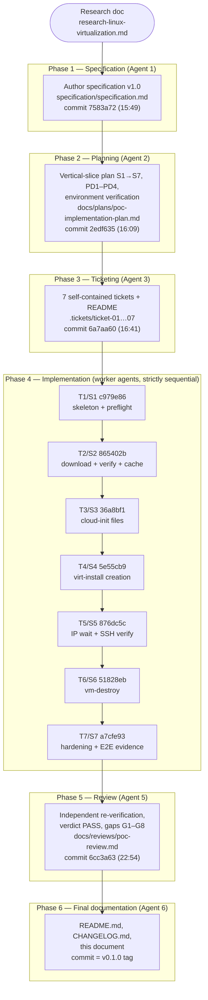

# POC Implementation Documentation — `vm-create` / `vm-destroy`

**Author:** Agent 6 (Final Documentation) · **Date:** 2026-08-25
**Scope:** what was done, in what order — the full development narrative,
per-ticket traceability, verification summary, and open follow-ups.
**Companion documents:**
[`specification/specification.md`](../specification/specification.md) ·
[`docs/plans/poc-implementation-plan.md`](plans/poc-implementation-plan.md) ·
[`.tickets/`](../.tickets/README.md) · [`docs/e2e-acceptance.md`](e2e-acceptance.md) ·
[`docs/reviews/poc-review.md`](reviews/poc-review.md)

---

## 1. Narrative — the orchestrated workflow, in order

The project was developed on a single host (Ubuntu 24.04, libvirt 10.0.0,
virt-install 4.1.0, user in `libvirt`+`kvm` groups, no sudo) by a
supervisor-orchestrated pipeline of six roles. Every phase produced a
committed artifact before the next phase started; the entire history is
twelve commits on 2026-08-25, from `c35c32b` (scaffold) to the final
documentation commit (tagged `v0.1.0`).



Each slice inside Phase 4 followed the same inner loop: **read the
ticket → implement → verify on the real host (tear down all test state) →
commit with the ticket's exact message**. No slice committed while its
verification was failing, and no test VM/volume carried over between
tickets (plan safety rule 2).

### Phase 1 — Specification (Agent 1)

- **Input:** the research document
  (`~/vault/04-Technology/research-linux-virtualization.md`), including its
  reference bash sketch and implicit decisions.
- **Output:** [`specification/specification.md`](../specification/specification.md)
  v1.0, committed as `7583a72` (2026-08-25 15:49).
- **What it fixed:** the CLI contract with exact defaults, exit codes
  (0/1/2) and an authoritative success-output block (§3.1); the six-step
  pipeline (§4); verified host facts and URLs (§5, verified live 2026-08-21);
  nine known pitfalls (§6); the five acceptance criteria (§7); and ten
  interpretation decisions D1–D10 (§10) — e.g. D1 (`--release` wins over
  `--image`), D3 (YAML indentation fix for `meta-data`), D4 (verify against
  the final image filename), D5 (`--no-boot` = stop-after-create),
  D6 (SSH verification mandatory before success output), D7 (idempotent
  `vm-destroy`).

### Phase 2 — Planning (Agent 2)

- **Output:** [`docs/plans/poc-implementation-plan.md`](plans/poc-implementation-plan.md),
  committed as `2edf635` (16:09).
- **What it fixed:** seven strictly sequential **vertical slices** S1→S7
  (§2), each an end-to-end increment with its own host-side verification;
  four planner decisions — **PD1** (S5's first real boot uses the host's
  pre-existing 674 MiB Noble image via `--image file://`, keeping the real
  resolute download for S7), **PD2** (idempotently generate the absent
  default `~/.ssh/id_ed25519` key before first real boot), **PD3** (AC4's
  host-reboot leg proven by autostart XML/symlink evidence, not by
  rebooting the host), **PD4** (the pre-existing `noble-server-cloudimg-amd64.img`
  volume is the expected steady-state pool contents); testability hooks
  (`VM_CREATE_CACHE_DIR`, `VM_CREATE_LEASE_FILE`); the per-slice commit
  messages; a testing-strategy table (fixture → real-stopped-VM → real-boot
  escalation); a risk table; and a read-only environment-verification table
  (§8) that established the host baseline (e.g. `virbr0.status` present but
  0 bytes — lease format unconfirmed).

### Phase 3 — Ticketing (Agent 3)

- **Output:** [`.tickets/`](../.tickets/README.md) — `ticket-01`…`ticket-07`
  plus a ticket-format README — committed as `6a7aa60` (16:41).
- **What it fixed:** one **self-contained** ticket per slice (a worker could
  implement it having read nothing else): title/goal, context (cited
  spec/plan sections, environment facts), deliverables (exact files),
  numbered implementation requirements (verbatim commands where precision
  matters), safety rules (`poc-` name prefix, teardown-before-commit, never
  touch `setup-test-vm` or the Noble volume, no sudo), checkable acceptance
  criteria with exact shell commands, the verification sequence, a
  definition of done, and the exact commit message.

### Phase 4 — Sequential worker implementation (tickets 01–07, in order)

One subsection per ticket: goal, what was implemented, verification
performed, commit.

#### Ticket 01 — S1: skeleton + preflight — commit `c979e86` (16:53)

- **Goal:** the full CLI surface of `bin/vm-create` with a stub after
  preflight, so every flag, precedence rule, error path, and exit code is
  exercisable before any VM work exists.
- **Implemented:** `#!/usr/bin/env bash` + `set -euo pipefail`; all spec
  §3.1 defaults; usage/help on stderr; parsing of all 10 options including
  D1 `--release`-over-`--image` precedence; `NAME` validation
  (`^[A-Za-z][A-Za-z0-9._-]*$`, invalid name → usage error, exit 2);
  positive-integer validation for `--ram/--vcpu/--disk`; all five preflight
  checks in order (libvirt reachable via `virsh list`; name not already
  defined; `vm-pool` active; `default` net active; SSH key exists non-empty)
  — deliberately **no** `systemctl is-active libvirtd` check (pitfall 8,
  socket-activated daemon); documented test hooks in the header (plan
  ground rule 5).
- **Verification (no VM touched):** no args → exit 2 + usage; `--ram 2`
  without NAME → exit 2; `--bogus` → exit 2; invalid names (`.bad`, `-bad`)
  → exit 2; `--ram 0` → exit 2; `setup-test-vm` (real pre-existing domain)
  → exit 1 `VM 'setup-test-vm' already defined` with no side effects;
  `--ssh-key /nonexistent` → exit 1 `ssh key not found`; a valid run
  (`--ssh-key ~/.ssh/id_rsa.pub`) passed all preflight and hit the stub.
  (All of these were later re-run independently by the reviewer — all
  correct.)
- **Commit:** `c979e86` "feat(vm-create): add script skeleton, CLI parsing,
  and preflight checks (ticket 01)".

#### Ticket 02 — S2: image download + SHA256 verify + cache — commit `865402b` (17:21)

- **Goal:** `fetch_and_verify_image()` implementing spec §4 step 2 + D1/D4
  with the `~/vm-images` cache, so a second same-release VM costs zero
  bandwidth (AC2's mechanism).
- **Implemented:** cache layout `<cache>/<release>/` and `<cache>/custom/`
  (root overridable by `VM_CREATE_CACHE_DIR`); D4 download-to-final-name +
  in-place `grep -F … | sha256sum -c -` verification; on any curl failure or
  mismatch the (partial/corrupt) file is removed and the script exits 1
  unless `--keep-going` finds a warm cache (warning + continue); D1
  skip-verify-with-warning when no same-directory `SHA256SUMS` is derivable
  for a bare `--image URL`; warm cache → skip download entirely.
- **Verification (fixture files in `/tmp`, no 820 MiB download, no VM):**
  `file://` image + same-dir `SHA256SUMS` → cached under `custom/`,
  verified, rc 0; source fixture deleted → second run is a cache hit with no
  download; corrupted/sums-mismatched file → exit 1 `SHA256 mismatch` with
  the file removed from the cache; dead URL + cold cache → exit 1;
  `--keep-going` + cold cache → exit 1; `--keep-going` + warm cache →
  warning + continue. (The reviewer later re-ran all six scenarios in
  isolation with their own fixtures — all correct.)
- **Commit:** `865402b` "feat(vm-create): add image download, sha256
  verification, and cache reuse (ticket 02)".

#### Ticket 03 — S3: cloud-init file generation — commit `36a8bf1` (17:44)

- **Goal:** `generate_cloud_init_files()` producing correct NoCloud
  `user-data`/`meta-data` per spec §4 step 3 + D2/D3.
- **Implemented:** fresh `mktemp -d` + `chmod 600` + trap cleanup (never a
  static path); `meta-data` with fresh lowercase UUID (`uuidgen | tr A-Z
  a-z`) and the D3-correct `hostnames:` block; `user-data` with the
  `#cloud-config` header, `manage_etc_hosts: true`, the `--user` cloud user
  (D2) with sudo + injected key line, `package_update: false`, and **no**
  `network:` section (pitfall 5); `VM_CREATE_CLOUD_INIT_DUMP` test hook.
- **Verification (dump hook + assertions, no VM):** both files parse as YAML
  (`python3 yaml.safe_load`); `hostnames.local/.host` == NAME; `id` matches
  the lowercase-UUID regex; user-data contains the exact public-key line,
  the correct `name:` for default and `--user tester`, the sudo line,
  `package_update: false`, and zero `network:` occurrences; two runs yield
  different `id:` values; no leaked temp dirs after exit.
- **Commit:** `36a8bf1` "feat(vm-create): generate cloud-init user-data and
  meta-data (ticket 03)".

#### Ticket 04 — S4: VM creation via `virt-install` — commit `5e55cb9` (18:31)

- **Goal:** actually create the VM (fixed MAC, full virt-install invocation,
  D5 `--no-boot`), proving the `<NAME>_vda.qcow2` volume-naming contract
  that ticket 06 depends on — with a real (stopped) libvirt domain and a
  tiny image, still no real boot and no 820 MiB download.
- **Implemented:** MAC generation `52:54:00:` + 3 random bytes
  (colon-formatted); the virt-install invocation per spec §4 step 4 with
  `--os-variant ubuntu-lts-latest`, file-based `--cloud-init
  user-data=,meta-data=,clouduser-ssh-key=,disable=on`, `--console none`,
  `--autostart`; D5 stop-after-create for `--no-boot` (guarded
  `virsh destroy` + the not-booted output variant). **Two documented,
  evidence-backed deviations for virt-install 4.1.0** (recorded in the
  script's Step-4 header): the spec-verbatim `--location $IMG --import` +
  `--disk size=…` shape hard-fails on this build (and self-created volumes
  would be named `<NAME>.qcow2`, breaking the `_vda` contract) → the image
  is pre-created as `vm-pool` volume `<NAME>_vda.qcow2` (`virsh
  vol-create-as` + `virsh vol-upload`) and attached via `--disk vol=…`; and
  `--extra-args console=ttyS0` is rejected for plain imported volumes on
  4.1.0 → omitted (the cloud image's own serial getty covers debugging).
- **Verification (real libvirt objects, tiny image, `--no-boot`):**
  `poc-s4` created **shut off** (D5 worked); `virsh dumpxml` shows the
  fixed MAC, `<autostart/>` marker, `type='network' name='default'`, disk
  source in `vm-pool`; `virsh vol-list vm-pool` shows exactly
  `poc-s4_vda.qcow2` (the naming proof for ticket 06); the script printed
  exactly the not-booted output variant; mandatory raw-virsh cleanup left no
  `poc-*` in the pool.
- **Commit:** `5e55cb9` "feat(vm-create): create VM via virt-install
  --import with fixed MAC (ticket 04)".

#### Ticket 05 — S5: wait-for-IP + SSH verification + access info — commit `876dc5c` (21:15)

- **Goal:** spec §4 steps 5–6 — lease-file polling, domstate cross-check,
  best-effort fallbacks, **mandatory** SSH verification before any success
  output (D6/AC3), and the exact §3.1 success block (D9).
- **Implemented:** `find_ip_for_mac()` + polling every 2 s × 60 (120 s)
  with case-insensitive fixed-MAC matching (lease path overridable by
  `VM_CREATE_LEASE_FILE`); `virsh domstate` cross-check on lease; fallbacks
  `virsh domifaddr` then `arp -n` (best-effort only); the SSH probe
  (`ssh -o ConnectTimeout=2 -o BatchMode=yes -o
  StrictHostKeyChecking=accept-new user@IP exit`) in a retry loop gating
  the success block; timeout errors naming `virsh console <NAME>`; the
  exact §3.1 block including the `Name:`/UUID line.
  **Key real-world adaptation (the slice's designated contingency):** the
  first real boot revealed that `/var/lib/libvirt/dnsmasq/virbr0.status` is
  **not** the assumed space-separated `<ip> <mac> <hostname>` format — it is
  a **pretty-printed JSON array** of lease objects (`ip-address`,
  `mac-address` (lowercase), `hostname`, `client-id`, `expiry-time`). The
  parser was adapted to JSON (`jq`, `python3` fallback) with a legacy
  2/3-column fallback retained, and the confirmed format recorded.
  `meta-data` additionally gained `local-hostname: <NAME>` (documented
  deviation — without it, NoCloud kept the image-default hostname `ubuntu`
  and the name-resolution promise would have silently broken).
- **Verification (two legs):** (1) fixture lease files pinning the parser
  contract (match, case-insensitive query, no-match, legacy 3-col, legacy
  2-col); (2) per PD1/PD2: idempotently generated the default ed25519 key,
  then **real first boot** — `bin/vm-create poc-s5 --ram 2 --vcpu 1 --disk 5
  --image file:///var/lib/libvirt/images/vms/noble-server-cloudimg-amd64.img`
  (the Noble image exercises the D1 no-derivable-sums warning path): the
  script blocked until SSH actually succeeded (~20–40 s first boot),
  printed the exact success block, `ssh ubuntu@<IP> 'hostname'` → `poc-s5`
  (proving `meta-data`/`manage_etc_hosts`), and `ssh ubuntu@poc-s5
  'hostname'` proved libvirt DNS resolution of the bare lease hostname;
  mandatory cleanup left the pool at the PD4 baseline.
- **Commit:** `876dc5c` "feat(vm-create): wait for DHCP lease, verify SSH,
  print access info (ticket 05)".

#### Ticket 06 — S6: `vm-destroy` companion — commit `51828eb` (21:31)

- **Goal:** create `bin/vm-destroy` exactly per spec §3.2 (destroy-if-running
  → undefine → `vol-delete <NAME>_vda.qcow2 vm-pool`, D7 tolerance, exact
  messages, 0/1/2 exit codes, no prompt).
- **Implemented:** the four-step behavior in the mandated order
  (vol-delete after destroy+undefine — deleting a still-attached volume
  fails); missing-volume detection treating "not found"-style
  `vol-delete` failures as the D7 branch (warning + exit 0); usage → exit 2;
  undefined domain → exit 1 `VM '<NAME>' is not defined`.
- **Verification (cheap real VMs, all torn down):** no arg → exit 2; unknown
  name → exit 1 "not defined"; shutoff `poc-s6` → exit 0 `VM 'poc-s6'
  destroyed and disk removed.` with the domain and volume gone; running
  `poc-s6` (recreated with S5's now-cached Noble image) → destroy +
  undefine + vol-delete, same result; missing-volume path → exit 0 with the
  already-absent note; never-touch proof: `setup-test-vm` still shut off and
  the pool held only the pre-existing Noble volume. (During verification a
  real boot needed slightly more than the then-60 s SSH window — the seed of
  the window widening in ticket 07.)
- **Commit:** `51828eb` "feat(vm-destroy): add companion teardown script
  (ticket 06)".

#### Ticket 07 — S7: hardening + full E2E acceptance — commit `a7cfe93` (22:24)

- **Goal:** the final slice — harden the scripts, run the complete
  end-to-end acceptance with the **real resolute image** (first real ~820
  MiB download), and record every command and output.
- **Implemented/changed:** the only functional change was the SSH
  verification window **60 s → 90 s** (`verify_ssh_reachable`: 30 → 45
  attempts at 2 s cadence), driven by a real boot observed in ticket 06;
  an investigation of the autostart evidence command found that on this
  libvirt 10.0.0 build `virsh dumpxml` **never** emits an `<autostart>`
  element — the flag is stored as a symlink in `/etc/libvirt/qemu/autostart/`
  and shown by `virsh list --all --autostart` (scratch-domain tests proved
  `virt-install --autostart` alone sets it, so **no script change was
  needed**); `docs/e2e-acceptance.md` created; plan §8 updated with the
  confirmed JSON lease format; README gained a "How to run" section.
- **Verification — the definitive run (full detail in
  [`docs/e2e-acceptance.md`](e2e-acceptance.md)):** after a state reset
  (cache removed, stale test-IP `known_hosts` entries purged), the sequence
  ran in order: **AC1** `bin/vm-create poc-1 --ram 2 --vcpu 1 --disk 10`
  from a clean state — real 821 MiB download, SHA256
  `9dc7c536…` matching `SHA256SUMS`, success block in 38.6 s, and
  `ssh ubuntu@192.168.122.190 'cat /etc/os-release'` → `VERSION_ID="26.04"`,
  `VERSION_CODENAME=resolute`; **AC5** exact same command re-run → exit 1
  `VM 'poc-1' already defined` in **18 ms** (preflight, before any
  image/VM work); **AC2** `bin/vm-create poc-2 --ram 1 --vcpu 1 --disk 5` →
  no download lines, only `image ready: …`, with a before/after `stat` pair
  (mtime, size, sha256 all unchanged); **AC3 negative leg** `poc-3` with a
  key the host's probe can't use → exit 1 `SSH to ubuntu@192.168.122.103 not
  reachable yet — check: virsh console poc-3` at 1 m 47 s, no success block;
  **AC4** autostart symlinks + `virsh list --all --autostart` for all three
  VMs (reboot leg by evidence per PD3), then `vm-destroy` ×3 → each exit 0
  `VM 'poc-N' destroyed and disk removed.`; **final orphan check** → only
  `setup-test-vm` (shut off, untouched) and exactly the pre-existing Noble
  volume in `vm-pool`. The escape hatch (Noble image if the resolute URL
  failed) was **not needed**.
- **Commit:** `a7cfe93` "test(e2e): record full acceptance evidence and
  apply hardening fixes (ticket 07)".

### Phase 5 — Review & verification (Agent 5)

- **Output:** [`docs/reviews/poc-review.md`](reviews/poc-review.md),
  committed as `6cc3a63` (22:54).
- **What was done:** read the full artifact chain and both scripts
  line-by-line; **independently re-ran** every safe, idempotent check — 10
  `vm-create` CLI/preflight probes, 2 `vm-destroy` probes, `bash -n`, the
  lease parser against JSON/legacy fixtures, `fetch_and_verify_image` in
  six scenarios with fresh `/tmp` fixtures, `generate_cloud_init_files`
  twice (default user + `--user tester`) with YAML parse and content
  asserts, and a `sha256sum` of the 821 MiB cached image vs its
  `SHA256SUMS` entry — all torn down, host state restored to the recorded
  baseline. The real E2E legs were **not** re-run because the recorded
  evidence is same-day and the host's current state matches the recorded
  post-run state exactly.
- **Verdict:** **PASS** — all five acceptance criteria satisfied with fresh
  recorded evidence; no blockers or majors. Findings: G1 (minor: dead
  keep-going sub-branch in `fetch_and_verify_image`), G2 (minor: `v0.1.0`
  tag not yet present — closed by this phase's successor, Agent 6), G3–G5
  (nits: `.default` DNS wording vs bare-name-only resolution on this host;
  `ubuntu-lts-latest`→24.04 warning; virt-install 4.1.0 non-TTY console
  noise), G6 (nit: spec should make `local-hostname:` normative), G7 (info:
  AC4 reboot leg verified by evidence, not a real reboot — PD3), G8
  (info: residual 24-bit MAC-collision risk).

### Phase 6 — Final documentation (Agent 6)

- **This document**, plus the rewritten [`README.md`](../README.md) (project
  front door: description, requirements, quickstart, CLI reference,
  architecture diagram, layout, process, status) and
  [`CHANGELOG.md`](../CHANGELOG.md) (Keep a Changelog, derived from the git
  history), committed together and tagged **`v0.1.0`**.

---

## 2. Slice ↔ commit timeline

```mermaid
timeline
    title virt-runner — slices vs. commits (all 2026-08-25)
    13:30 : c35c32b project scaffold
    15:49 : 7583a72 Phase 1 — specification v1.0
    16:09 : 2edf635 Phase 2 — plan, slices S1–S7
    16:41 : 6a7aa60 Phase 3 — tickets 01–07
    16:53 : c979e86 S1/T1 skeleton + preflight
    17:21 : 865402b S2/T2 download + SHA256 + cache
    17:44 : 36a8bf1 S3/T3 cloud-init files
    18:31 : 5e55cb9 S4/T4 virt-install creation (fixed MAC, --no-boot)
    21:15 : 876dc5c S5/T5 lease wait + SSH verify (real Noble first boot)
    21:31 : 51828eb S6/T6 vm-destroy
    22:24 : a7cfe93 S7/T7 E2E acceptance (real resolute) + hardening
    22:54 : 6cc3a63 Phase 5 — review, verdict PASS
    final : docs commit — README, CHANGELOG, this doc — tag v0.1.0
```

---

## 3. Traceability table

Ticket → slice → commit(s) → acceptance criteria (spec §7) satisfied.

| Ticket | Slice | Commit(s) | Acceptance criteria satisfied |
|---|---|---|---|
| ticket-01 (skeleton + preflight) | S1 | `c979e86` | AC5 mechanism (duplicate-domain check, proven against real `setup-test-vm`); CLI/exit-code contract for all ACs |
| ticket-02 (download + verify + cache) | S2 | `865402b` | AC2 mechanism (single-download cache; reuse, corruption, and `--keep-going` paths proven with fixtures) |
| ticket-03 (cloud-init files) | S3 | `36a8bf1` | supporting AC3/AC1 (hostname + key injection correctness — prerequisite for SSH and DNS-name acceptance) |
| ticket-04 (virt-install creation) | S4 | `5e55cb9` | AC4 mechanism (`--autostart` in the created domain; `<NAME>_vda.qcow2` naming proof on which teardown/no-orphan depends) |
| ticket-05 (wait-for-IP + SSH verify) | S5 | `876dc5c` | AC3 (real first boot: lease → mandatory SSH probe → success block; timeout path with `virsh console` hint); lease-format finding |
| ticket-06 (vm-destroy) | S6 | `51828eb` | AC4 mechanism (all teardown paths: shutoff, running, missing-volume; no orphans; pre-existing objects untouched) |
| ticket-07 (hardening + E2E) | S7 | `a7cfe93` | AC1 (clean-state resolute creation, 26.04 over SSH), AC2 (stat-pair cache-reuse proof), AC3 (recorded negative leg), AC4 (autostart evidence + teardown, orphan-free pool), AC5 (18 ms fail-fast re-run) — **all five closed here** |

Phase commits (outside the ticket loop): `c35c32b` (scaffold), `7583a72`
(spec), `2edf635` (plan), `6a7aa60` (tickets), `6cc3a63` (review), and the
final documentation commit (tag `v0.1.0`).

---

## 4. Verification summary

Key evidence, from [`docs/e2e-acceptance.md`](e2e-acceptance.md) (definitive
run 2026-08-25 ~22:05, real resolute image, verbatim outputs) and
[`docs/reviews/poc-review.md`](reviews/poc-review.md) (independent
re-verification ~22:35–22:50):

| AC | Evidence (e2e section) | Review re-verification |
|---|---|---|
| **AC1** clean-state `poc-1 --ram 2 --vcpu 1 --disk 10` | §4.0–4.1: clean-state check → rc 0 in 38.6 s; 821 MiB image on disk; sha256 `9dc7c5363c0146a08ba0c9aa834d82c2c6dfbb1c471ad9a2f0aba1189e21be05` matching `SHA256SUMS`; `cat /etc/os-release` over SSH → `VERSION_ID="26.04"`, `VERSION_CODENAME=resolute`; `hostname` → `poc-1` | Re-hashed the cached image the next day — matches `SHA256SUMS` |
| **AC2** exactly one download; cache reuse | §4.3: before/after `stat` pair of the cached image (identical mtime `2026-08-25 22:06:09.041851682 +0200`, size 860447744, sha256) across `poc-2` creation; output has no download lines, only `image ready: …` (13 s total) | Re-ran `fetch_and_verify_image` with the source deleted — cache hit, no download |
| **AC3** success only after proven SSH; else timeout + console hint | Positive: success block appears only after `IP acquired:` + a real SSH round-trip in all three positive runs. Negative (§4.4): `poc-3` with a non-matching key → rc 1 `SSH to ubuntu@192.168.122.103 not reachable yet — check: virsh console poc-3` at 1 m 47 s, **no** success block | Code inspection: a `die` precedes any success output |
| **AC4** survives host reboot; teardown leaves no orphan | §2 (scratch test: `virt-install --autostart` alone creates the marker), §4.5 (`/etc/libvirt/qemu/autostart/poc-{1,2,3}.xml` symlinks + `virsh list --all --autostart`; `vm-destroy` ×3 → rc 0), §4.6 (final: only `setup-test-vm` shut off; pool = exactly the Noble volume). Note: `virsh dumpxml \| grep '<autostart'` never matches on libvirt 10.0.0 (host-native observables substituted, §5.3); a real reboot is an optional manual check (PD3) | Re-ran `virsh list --all` + `virsh vol-list vm-pool` — identical to the recorded post-run state |
| **AC5** same-name re-run fails fast | §4.2: immediate re-run of the exact `poc-1` command → `VM 'poc-1' already defined`, rc 1 in **18 ms**, before any image/VM work | Re-ran `bin/vm-create setup-test-vm` → rc 1, no side effects |

Additional recorded findings: the confirmed **JSON lease-file format**
(e2e §5.1; parser re-confirmed on all three resolute boots — no fallbacks
needed); bare-name-only DNS resolution vs the spec-verbatim `.default`
wording (e2e §5.2); the osinfo-db gap warning (e2e §5.5); the `known_hosts`
IP-reuse hazard and its handling (e2e §5.4); first-boot time-to-IP ~15–17 s
(e2e §5.7). The reviewer found no blockers or majors (gaps G1–G8 below).

---

## 5. Known gaps / follow-ups

### From the review (G1–G8, `docs/reviews/poc-review.md` §3)

- **G1 (minor):** dead code in `fetch_and_verify_image` — the
  `--keep-going` sub-branch after the failure `rm -f` is unreachable (the
  warm-cache behavior is correctly delivered by the earlier cache-hit
  branch). Follow-up: delete the dead branch or move the `-f` test before
  the `rm -f`; add a comment.
- **G2 (minor, closed):** `v0.1.0` tag was missing at review time; the
  final-documentation commit is now tagged `v0.1.0`.
- **G3 (nit):** the success block's `(also reachable as <NAME>.default)`
  wording is spec-verbatim, but on this host only the **bare** name
  resolves. Follow-up: drop the `.default` clause or document the bare-name
  form.
- **G4 (nit):** `--os-variant ubuntu-lts-latest` resolves to `ubuntu24.04`
  (warning on every run). Harmless today; revisit after any `osinfo-db`
  update and switch to `ubuntu-26.04` once it exists.
- **G5 (nit):** virt-install 4.1.0 prints transient console noise in
  non-TTY runs. Follow-up: consider `--noautoconsole` or redirecting that
  phase.
- **G6 (nit):** `meta-data`'s `local-hostname:` (ticket-05 deviation,
  required for the hostname to actually apply) should be made normative in
  a next spec revision.
- **G7 (info):** AC4's host-reboot leg is verified by autostart
  XML/symlink + `--autostart` list evidence, not an actual reboot (PD3 —
  a manual reboot check remains open by design).
- **G8 (info):** residual MAC-collision risk (`52:54:00:` + 24 random
  bits) — accepted for a POC.

### From the specification (spec §8 — out of scope / follow-ups)

- `vm-list` companion; `vm-create --template <name>` (clone from a golden
  VM via qcow2 backing chain / `virt-clone`).
- Static IP per VM (dnsmasq `addnhosts` or a dedicated `network=` with
  `<ipaddr>`/`<host>` entries).
- `qemu-guest-agent` in the image for `virsh domifaddr --source agent` and
  clean shutdowns.
- UEFI guests (`--boot uefi`, needs OVMF).
- Inbound access from outside the host (NAT forward rule or host DNAT/socat
  port forward).
- Multi-release user table (per-distro default users beyond Ubuntu's
  `ubuntu`).
- Optional `--clean-cache` flag.
- Placing the scripts in `~/bin` (POC ran them by path from `bin/`;
  symlink/copy is the recommended install per the README).
