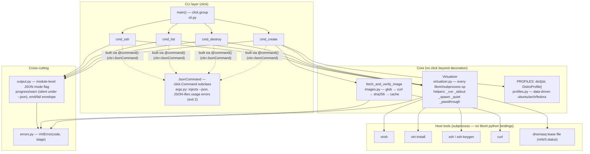
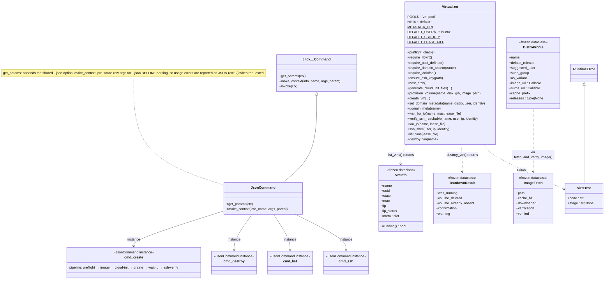
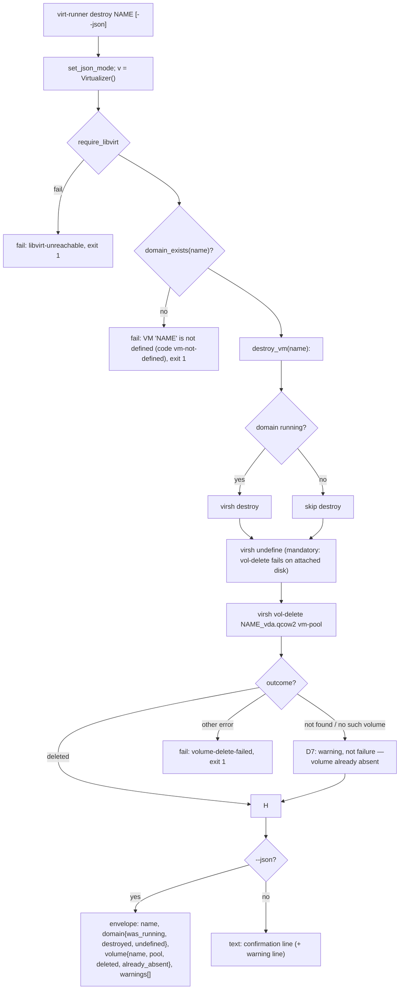
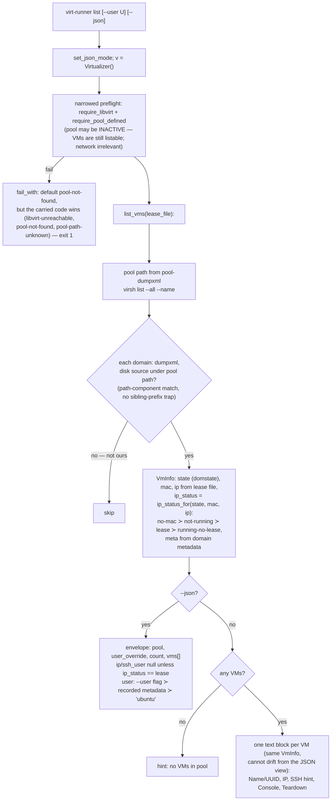
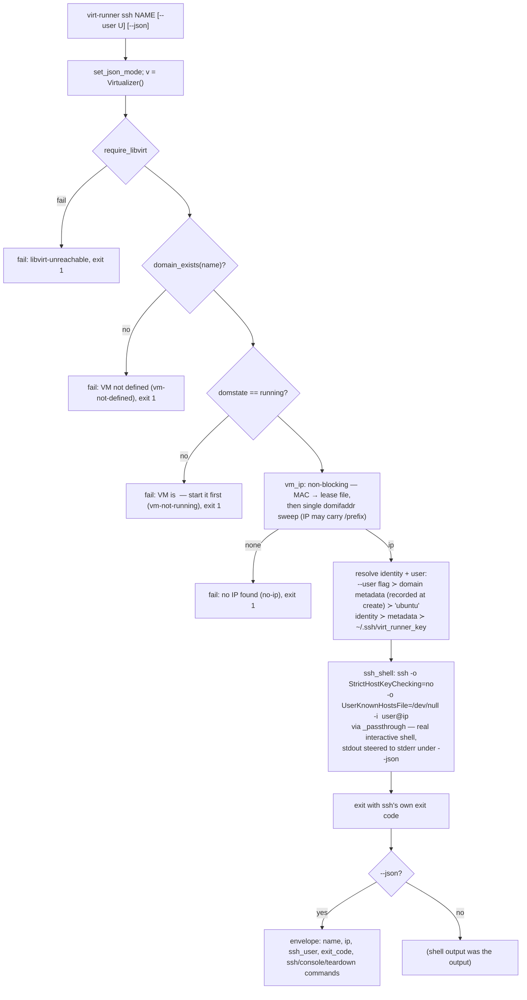
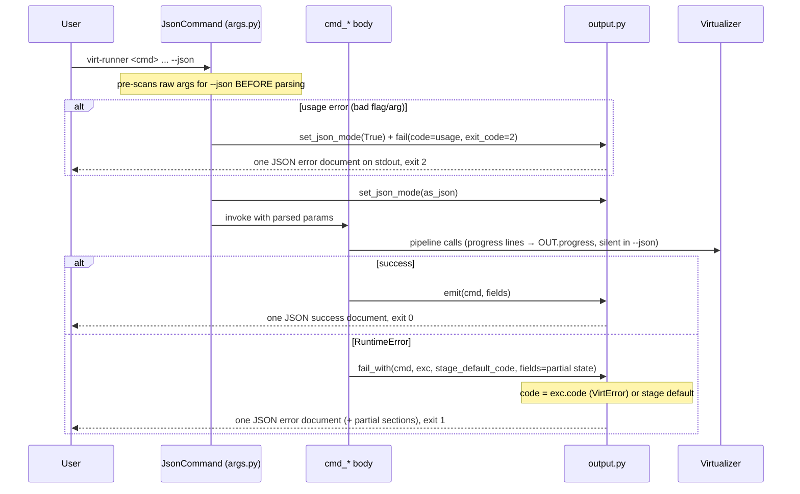

# Architecture diagrams

Diagrams and walkthrough of `virt-runner`'s module layout, class hierarchy, and
the main logic flow of each subcommand. Generated from the source in
`src/virt_runner/` (see the code — it is the source of truth).

## 1. Module / component architecture

**Design in one paragraph:** two strict layers. The `cmd_*.py` files are thin
CLI adapters: argument validation (click callbacks), pipeline orchestration via
a `stage` variable, and rendering. Everything that touches the host lives in
`Virtualizer` (subprocess-only; every call goes through one of five helpers so
error semantics — raise / capture / ignore / passthrough — are explicit at the
call site) and `images.py`. `output.py` is a tiny module-level state machine:
one bool decides whether stdout carries human text or exactly one JSON
envelope; `--json` suppresses all progress output so
`virt-runner create x --json | jq .` is always clean. Errors are `VirtError`
(a `RuntimeError` carrying a stable `code` + pipeline `stage`), which the CLI
layer converts into the JSON error envelope or a `vm-<cmd>: message` stderr
line. Exit codes never depend on output mode: 0 success, 1 runtime/preflight,
2 usage.

## 2. Class hierarchy

Notes:

- The four subcommands are **instances** of `JsonCommand`, not subclasses —
  `args.command()` is `click.command()` with `cls=JsonCommand` as default, so
  `@command(name="create")` yields a `JsonCommand` object. The only true
  subclassing in the package is `JsonCommand → click.Command`.
- `Virtualizer` is a flat class with no inheritance; its public methods mirror
  the pipeline steps of the original bash scripts.
- The four dataclasses are pure fact records: `VmInfo`/`TeardownResult`
  (rendered verbatim by `cmd_list`/`cmd_destroy`), `ImageFetch` (rendered by
  the `create` document), `DistroProfile` (data-driven config — the pipeline
  code has no distro-name conditionals).
- `VirtError` extends `RuntimeError` on purpose: existing
  `except RuntimeError` handlers keep working, while the CLI layer reads
  `.code`/`.stage` for the JSON envelope instead of string-matching messages.

## 3. Flow of the subcommands

### 3.1 `create` — the full pipeline

```mermaid
flowchart TD
    A["virt-runner create NAME [options] [--json]"] --> B{"JsonCommand.make_context"}
    B -->|parse failure| C{"--json in raw args?"}
    C -->|yes| C1["JSON error envelope, code=usage, exit 2"]
    C -->|no| C2["click usage error, exit 2"]
    B -->|parsed| F["set_json_mode(as_json)<br/>v = Virtualizer(); profile = PROFILES[distro]"]
    F --> G["D1 precedence: explicit --release wins over --image<br/>resolve image_url, effective_release, effective_user<br/>build run_state dict (accumulated through the run)"]

    G --> H["stage := preflight"]
    H --> H1{"x86_64? · virsh list ok?<br/>pool vm-pool active?<br/>net default active?<br/>domain absent?<br/>virtiofsd present (if --mount)?"}
    H1 -->|fail| X
    H1 -->|pass| H2["ensure_ssh_key: reuse / derive via ssh-keygen -y /<br/>generate ed25519 keypair (no partial key left behind)"]

    H2 --> I["stage := image"]
    I --> I1["fetch_and_verify_image (images.py):<br/>cache dir ~/vm-images[/prefix/release] (VM_CREATE_CACHE_DIR)<br/>glob resolve (Fedora rotating names, newest first, cache fallback)<br/>cache hit? → ImageFetch(verification from .verified marker)<br/>else curl -fL --retry 3 → sha256 vs own SHA256SUMS entry<br/>(.verified marker written; no entry or mismatch = fail)"]
    I1 -->|ImageFetch| J["stage := cloud-init"]
    I1 -->|VirtError| X

    J --> J1["render_user_data / render_meta_data (pure fns)<br/>user: sudo + ssh_authorized_keys; bootcmd: virtiofs mounts<br/>temp dir kept for virt-install, removed via atexit"]
    J1 --> K["stage := create"]

    K --> K1["provision_volume:<br/>virsh vol-create-as (qcow2) → vol-upload → vol-resize<br/>(PI-1: vol-upload silently resizes; cleanup vol on any failure)"]
    K1 --> K2["generate_mac: 52:54:00:<random 3 bytes>"]
    K2 --> K3["create_vm: virt-install --import --cloud-init ...<br/>via _passthrough (user sees its own output;<br/>under --json stdout steered to stderr)<br/>on failure: destroy + undefine + vol-delete — nothing left behind<br/>--memorybacking shared + --filesystem virtiofs per --mount"]
    K3 --> K4["run_state: created, domain_state, uuid<br/>set_domain_metadata (distro/user/identity; warn-only on failure)"]
    K4 --> L{"--no-boot?"}

    L -->|yes| M["stop domain if running; state := shut off"]
    L -->|no| N["stage := wait-ip<br/>poll dnsmasq lease file (JSON, legacy fallback), 120 s @ 2 s<br/>lease accepted only while domain is running<br/>fallbacks ONLY if lease file unusable: domifaddr (30 s), arp -n"]
    N --> O["stage := ssh-verify<br/>poll ssh BatchMode probe (injected identity, known_hosts=/dev/null), 90 s"]

    M --> P
    O --> P
    P{"done without error?"}

    P -->|RuntimeError at any stage| X["output.fail_with: code from VirtError else stage default<br/>(preflight→libvirt-unreachable, image→image-download-failed,<br/>cloud-init→cloud-init-failed, create→vm-create-failed,<br/>wait-ip→lease-timeout, ssh-verify→ssh-timeout)<br/>JSON: error envelope + partial run_state (vm/image sections already earned)<br/>text: vm-create: message — exit 1"]
    P -->|success| Q{"--json?"}
    Q -->|yes| R["emit success envelope: booted + vm{name,uuid,state,specs,mac,ip,<br/>dns_name,ssh_user,ssh/console/teardown commands,autostart} + image{...}"]
    Q -->|no| S["text: Name/UUID, Distro, IP (+ name.default), SSH hint,<br/>mount lines, Console/Teardown lines"]
```

Key invariants of the pipeline:

- **One `try`, one `stage` variable.** A failure at any stage is caught once;
  the stage name picks the default error code, and `run_state` (filled as
  stages complete) is rendered into the JSON error document, so a late failure
  (e.g. lease timeout) still reports the running VM and its image.
- **Nothing left behind.** Failed volume import, failed `virt-install`, or a
  missing keypair all clean up after themselves (PI-12).
- **IP discovery is lease-file-first.** `domifaddr`/`arp` are best-effort
  fallbacks only when the dnsmasq lease file is unusable (PI-7/PI-8).

### 3.2 `destroy`

### 3.3 `list`

### 3.4 `ssh`

### 3.5 Cross-cutting: `--json` mode and error plumbing

